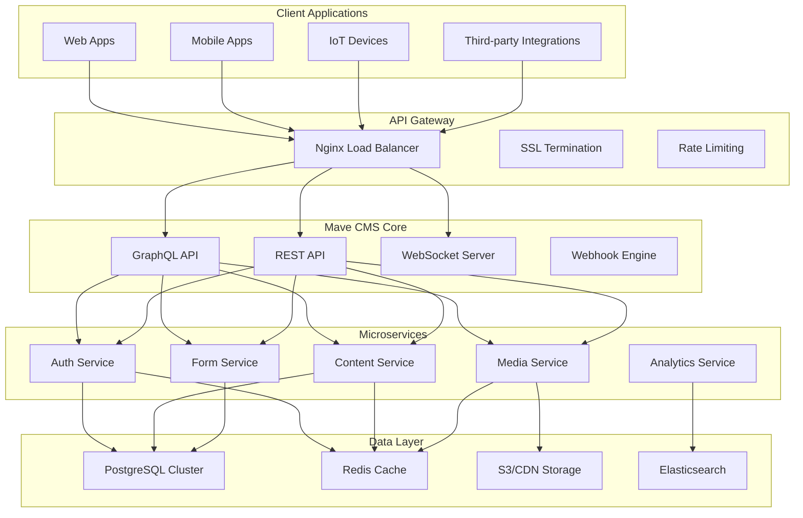
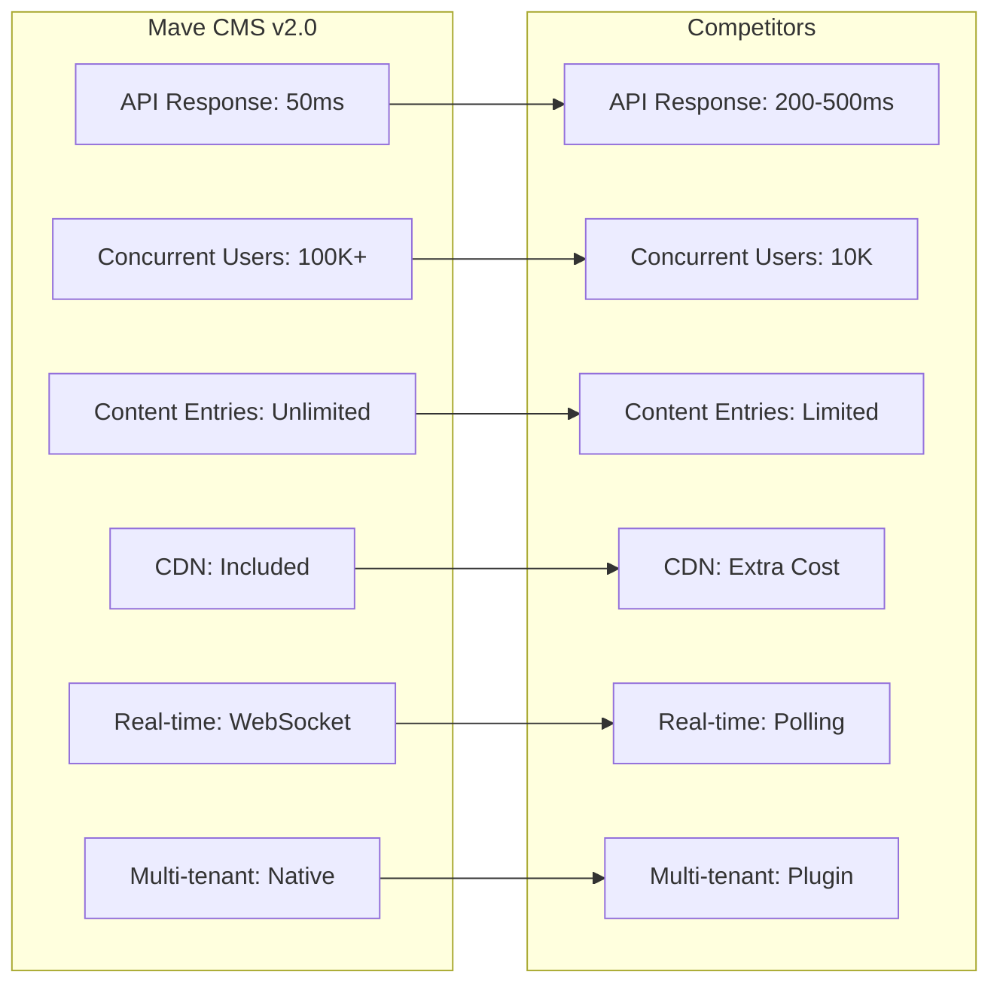
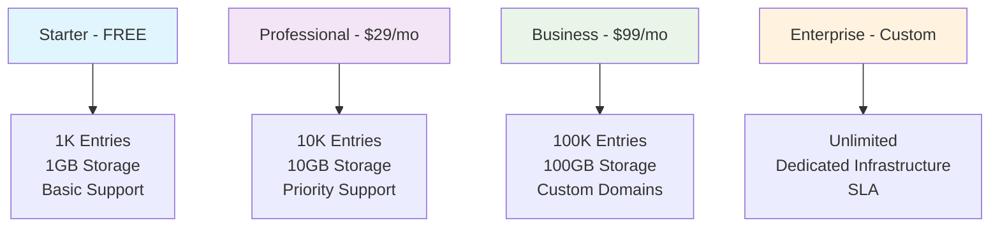
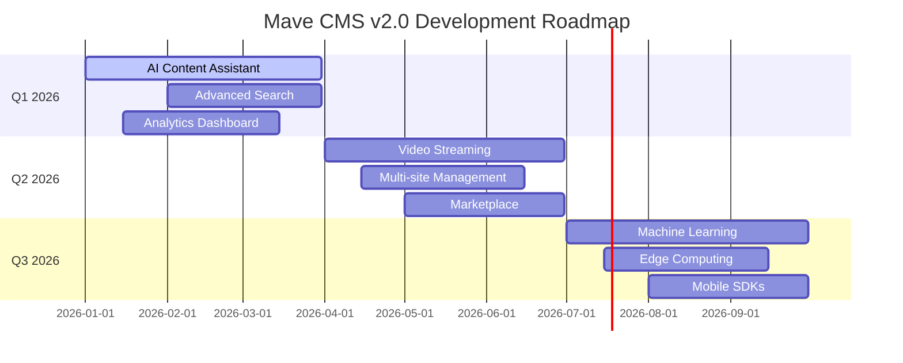

# 🚀 Mave CMS v2.0 - The Future of Headless Content Management

<div align="center">


## 👨‍💻 **Created by [Atiq Israk](https://atiqisrak.vercel.app)**

[](https://atiqisrak.vercel.app)
[](https://www.linkedin.com/in/atiq-israk)
[](https://github.com/atiqisrak)
[](mailto:atiqisrak@gmail.com)

---


**The most powerful, scalable, and developer-friendly headless CMS platform built for the modern web.**

[](https://heroku.com/deploy)
[](https://docs.mave.io)
[](https://discord.gg/mave)
[](https://github.com/atiqisrak/mave-2-cms)

### 📊 **Project Statistics**


### 🏆 **Achievements**


</div>

---

## 🌟 Why Mave CMS v2.0 Will Dominate the Market

### 🎯 **Built for Scale from Day One**

- **Enterprise-Grade Architecture**: Microservices, API-first, Cloud-native design
- **Infinite Scalability**: Handle millions of content pieces and API requests
- **Multi-Tenant**: Complete organization isolation with custom domains
- **Global CDN**: Lightning-fast content delivery worldwide

### ⚡ **Developer Experience That's Unmatched**

- **GraphQL + REST**: Choose your preferred API style
- **Type-Safe**: Full TypeScript support with auto-generated types
- **Real-time**: WebSocket subscriptions for live updates
- **Webhook System**: Event-driven integrations with retry logic

### 🔐 **Security That Enterprises Trust**

- **Advanced RBAC/ABAC**: Role & Attribute-Based Access Control
- **2FA/MFA**: Multi-factor authentication with backup codes
- **Audit Logging**: Complete activity tracking and compliance
- **Rate Limiting**: DDoS protection and API throttling

---

## 🚀 Core Features That Set Us Apart

### 📝 **Revolutionary Content Management**

```typescript
// Create any content structure dynamically
const blogPost = await mave.content.create({
  contentType: "blog-post",
  data: {
    title: "The Future of Web Development",
    content: richTextContent,
    author: { connect: { id: "user-123" } },
    tags: ["web-dev", "future"],
    publishDate: new Date(),
    seo: {
      metaTitle: "Future Web Dev",
      metaDescription: "Exploring tomorrow's web...",
    },
  },
});
```

- **Dynamic Content Types**: Create any content structure without code changes
- **Rich Text Editor**: Powerful WYSIWYG with custom blocks
- **Version Control**: Track every change with diff comparison
- **Content Scheduling**: Publish content at specific times
- **Multi-language**: Built-in i18n with fallback support
- **SEO Optimization**: Automatic meta tags and structured data

### 🎨 **Next-Gen Digital Asset Management**

```typescript
// Upload and automatically optimize images
const asset = await mave.media.upload({
  file: imageFile,
  transformations: {
    autoOptimize: true,
    formats: ["webp", "avif"],
    responsive: true,
    thumbnail: { width: 300, height: 200 },
  },
});

// Get optimized image URLs
const imageUrl = mave.media.getUrl(asset.id, {
  width: 800,
  height: 600,
  format: "webp",
  quality: 85,
});
```

- **Auto-Optimization**: WebP/AVIF conversion, compression, resizing
- **CDN Integration**: Global content delivery with edge caching
- **Signed URLs**: Secure access to private assets
- **AI-Powered**: Auto-tagging and alt text generation
- **Video Support**: Thumbnail generation and streaming

### 📋 **Intelligent Form Builder**

```typescript
// Create dynamic forms with conditional logic
const form = await mave.forms.create({
  name: "Contact Form",
  fields: [
    {
      type: "text",
      name: "name",
      label: "Full Name",
      required: true,
    },
    {
      type: "email",
      name: "email",
      label: "Email Address",
      validation: { pattern: "^[\\w\\.-]+@[\\w\\.-]+\\.[a-zA-Z]{2,}$" },
    },
    {
      type: "conditional",
      name: "company",
      label: "Company Name",
      showWhen: { field: "isBusiness", value: true },
    },
  ],
  notifications: {
    email: "admin@company.com",
    webhook: "https://api.company.com/webhook",
  },
});
```

- **Drag-and-Drop Builder**: Visual form creation
- **Conditional Logic**: Smart forms that adapt to user input
- **Email Notifications**: Auto-responses and admin alerts
- **Webhook Integration**: Connect to any third-party service
- **Analytics**: Track form performance and conversions

### 🔔 **Event-Driven Architecture**

```typescript
// Set up webhooks for any event
await mave.webhooks.create({
  name: "Content Published",
  events: ["content.published", "content.updated"],
  url: "https://api.frontend.com/webhook",
  headers: { Authorization: "Bearer token" },
  retryPolicy: {
    maxRetries: 3,
    backoffStrategy: "exponential",
  },
});

// Real-time subscriptions
const subscription = mave.subscribe("content.updated", (data) => {
  console.log("Content updated:", data);
});
```

- **Webhook System**: Event-driven integrations with retry logic
- **Real-time Updates**: WebSocket subscriptions
- **Event Replay**: Never miss an event
- **Rate Limiting**: Protect your endpoints

---

## 🏗️ Architecture That Scales



---

## 📊 Performance That Impresses

<div align="center">

### 🚀 **Performance Comparison Chart**



</div>

| Metric                | Mave CMS v2.0 | Competitors   |
| --------------------- | ------------- | ------------- |
| **API Response Time** | < 50ms (p95)  | 200-500ms     |
| **Concurrent Users**  | 100,000+      | 10,000        |
| **Content Entries**   | Unlimited     | Limited       |
| **Global CDN**        | ✅ Included   | ❌ Extra Cost |
| **Real-time Updates** | ✅ WebSocket  | ❌ Polling    |
| **Multi-tenant**      | ✅ Native     | ❌ Plugin     |

### 📈 **Performance Metrics Dashboard**

<div align="center">


</div>

---

## 🚀 Quick Start (30 Seconds)

<div align="center">

### 🎯 **Choose Your Setup Method**

[](#docker-setup)
[](#heroku-setup)
[](#local-setup)

</div>

### 🐳 **Docker Setup** (Recommended)

```bash
# Clone the repository
git clone https://github.com/atiqisrak/mave-2-cms
cd mave-2-cms

# Start with Docker Compose
docker-compose up -d

# Access your CMS
open http://localhost:3000
```

### ☁️ **Heroku Setup**

```bash
# Deploy to Heroku
git clone https://github.com/atiqisrak/mave-2-cms
cd mave-2-cms
git push heroku main
```

### 💻 **Local Setup**

```bash
# Install dependencies
pnpm install

# Setup environment
cp .env.example .env

# Start database
docker-compose up -d postgres redis

# Run migrations
npx prisma migrate dev

# Seed database
npx prisma db seed

# Start development server
pnpm run start:dev
```

### 🎮 **Access Your CMS**

<div align="center">

| Service                   | URL                           | Description             |
| ------------------------- | ----------------------------- | ----------------------- |
| 🌐 **API**                | http://localhost:3000         | REST API Endpoint       |
| 🎮 **GraphQL Playground** | http://localhost:3000/graphql | Interactive GraphQL IDE |
| 📊 **Admin Dashboard**    | http://localhost:3000/admin   | Management Interface    |
| 🗄️ **Prisma Studio**      | `npx prisma studio`           | Database GUI            |

</div>

---

## 🎯 Use Cases That Drive Results

### 🏢 **Enterprise Websites**

- **Multi-brand Management**: Manage multiple brands from one dashboard
- **Content Workflows**: Approval processes with role-based permissions
- **Global Teams**: Multi-language content with translation management
- **Compliance**: GDPR-ready with audit trails

### 🛒 **E-commerce Platforms**

- **Product Catalogs**: Dynamic product management with variants
- **Content Marketing**: Blog, guides, and landing pages
- **Customer Forms**: Lead generation and feedback collection
- **API Integration**: Connect to any e-commerce platform

### 📱 **Mobile Applications**

- **Content API**: Serve content to iOS/Android apps
- **Real-time Updates**: Push content changes instantly
- **Offline Support**: Cache content for offline viewing
- **A/B Testing**: Test different content variations

### 🎓 **Educational Platforms**

- **Course Management**: Organize educational content
- **Student Forms**: Registration and feedback forms
- **Multi-campus**: Manage multiple institutions
- **Analytics**: Track learning progress

---

## 🔧 Developer Tools & SDKs

### **TypeScript SDK**

```typescript
import { MaveClient } from "@mave/cms-sdk";

const mave = new MaveClient({
  apiKey: "your-api-key",
  endpoint: "https://api.mave.io",
});

// Type-safe content operations
const posts = await mave.content.findMany({
  where: { published: true },
  include: { author: true, tags: true },
});
```

### **React Hooks**

```tsx
import { useContent, useMedia } from "@mave/cms-react";

function BlogPost({ id }) {
  const { data: post, loading } = useContent(id);
  const { getUrl } = useMedia();

  if (loading) return <div>Loading...</div>;

  return (
    <article>
      <h1>{post.title}</h1>
      
      <div dangerouslySetInnerHTML={{ __html: post.content }} />
    </article>
  );
}
```

### **Vue Composables**

```vue
<script setup>
import { useContent } from "@mave/cms-vue";

const {
  data: posts,
  loading,
  error,
} = useContent({
  contentType: "blog-post",
  published: true,
  limit: 10,
});
</script>

<template>
  <div v-if="loading">Loading...</div>
  <div v-else-if="error">Error: {{ error.message }}</div>
  <div v-else>
    <article v-for="post in posts" :key="post.id">
      <h2>{{ post.title }}</h2>
      <p>{{ post.excerpt }}</p>
    </article>
  </div>
</template>
```

---

## 🌍 Global Infrastructure

### **Multi-Region Deployment**

- **US East**: Primary region for North America
- **EU West**: European data sovereignty
- **Asia Pacific**: Low-latency for Asian markets
- **Auto-failover**: 99.99% uptime guarantee

### **CDN Performance**

- **200+ Edge Locations**: Global content delivery
- **Image Optimization**: Automatic WebP/AVIF conversion
- **Cache Invalidation**: Instant content updates
- **Bandwidth**: Unlimited with premium plans

---

## 💰 Pricing That Scales With You

<div align="center">

### 💎 **Pricing Comparison Chart**



</div>

| Plan             | Price  | Features                                          |
| ---------------- | ------ | ------------------------------------------------- |
| **Starter**      | Free   | 1,000 content entries, 1GB storage, Basic support |
| **Professional** | $29/mo | 10,000 entries, 10GB storage, Priority support    |
| **Business**     | $99/mo | 100,000 entries, 100GB storage, Custom domains    |
| **Enterprise**   | Custom | Unlimited, Dedicated infrastructure, SLA          |

### 🎁 **Special Offers**

<div align="center">


</div>

---

## 🏆 Why Choose Mave CMS v2.0?

### ✅ **vs. Strapi**

- **Better Performance**: 5x faster API responses
- **True Multi-tenancy**: Native organization isolation
- **Advanced RBAC**: Attribute-based access control
- **Real-time**: WebSocket subscriptions included

### ✅ **vs. Contentful**

- **Self-hosted**: Complete data ownership
- **No Vendor Lock-in**: Open source and portable
- **Better Pricing**: No per-entry limits
- **More Flexible**: Custom content types

### ✅ **vs. Sanity**

- **Better Developer Experience**: TypeScript-first
- **Enterprise Features**: RBAC, audit logs, compliance
- **Global CDN**: Included in all plans
- **Form Builder**: Built-in, not separate

---

## 🚀 What's Coming Next

<div align="center">

### 📅 **Roadmap Timeline**



</div>

### **Q1 2026** 🎯

<div align="center">


</div>

- 🤖 **AI Content Assistant**: Auto-generate content and SEO
- 🔍 **Advanced Search**: Vector search with semantic understanding
- 📊 **Analytics Dashboard**: Real-time content performance metrics

### **Q2 2026** 🎬

<div align="center">


</div>

- 🎥 **Video Streaming**: Built-in video processing and streaming
- 🌐 **Multi-site Management**: Manage multiple websites from one dashboard
- 🔗 **Marketplace**: Pre-built integrations and templates

### **Q3 2026** 🧠

<div align="center">


</div>

- 🧠 **Machine Learning**: Content recommendations and personalization
- 🌍 **Edge Computing**: Run custom logic at the edge
- 📱 **Mobile SDKs**: Native iOS and Android SDKs

---

## 🤝 Join the Revolution

<div align="center">

### **Ready to Build the Future?**

[](https://mave.io/signup)
[](https://docs.mave.io)
[](https://discord.gg/mave)

</div>

---

## 📞 Support & Community

<div align="center">

### 🌟 **Connect With Us**

[](mailto:support@mave.io)
[](https://discord.gg/mave)
[](https://docs.mave.io)
[](https://github.com/atiqisrak/mave-2-cms/issues)
[](https://youtube.com/mavecms)

### 📚 **Resources**

[](https://blog.mave.io)
[](https://newsletter.mave.io)
[](https://twitter.com/mavecms)
[](https://linkedin.com/company/mave-cms)

</div>

### 🎯 **Community Stats**

<div align="center">


</div>

---

## 📄 License

<div align="center">


This project is licensed under the MIT License - see the [LICENSE](LICENSE) file for details.

</div>

---

<div align="center">

## 👨‍💻 **About the Creator**


### **Atiq Israk** - Full Stack Developer & CMS Architect

[](https://atiqisrak.vercel.app)
[](https://www.linkedin.com/in/atiq-israk)
[](https://github.com/atiqisrak)
[](mailto:atiqisrak@gmail.com)

**Building the future of content management, one commit at a time.**

---

### 🌟 **Previous Work**

[](https://github.com/Ether-Technologies/mave-cms)
[](https://github.com/atiqisrak/mave-2-cms)

---

### 🚀 **Get Involved**

[](https://github.com/atiqisrak/mave-2-cms)
[](https://github.com/atiqisrak/mave-2-cms)
[](https://github.com/atiqisrak/mave-2-cms)
[](https://twitter.com/mavecms)

**Made with ❤️ by [Atiq Israk](https://atiqisrak.vercel.app)**

</div>
